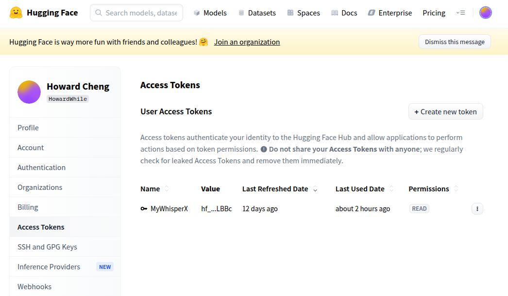

# Readme

## 初始化環境

**步驟一：建立並啟用 Conda 環境（建議使用 Python 3.10）**
```shell
conda create -n whisperx python=3.10 -y
conda activate whisperx
```

**記得之後的操作都要使用conda切換環境到whisperx**

**步驟二：使用 pip 安裝 WhisperX**

```shell
pip install whisperx
```

**測試是否安裝成功**

```shell
python -m whisperx
```

```shell
python -c "import whisperx; print('WhisperX 安裝成功！')"
```

簡易的轉檔測試

```shell
conda activate whisperx
whisperx input.mp3 \
  --model large-v2 \
  --chunk_size 6 \
  --language zh \
  -f all \
  --vad_method silero \
  --verbose True  
```


**步驟三︰配置語者分離的環境**

若要啟用講者分類功能，請在 `--hf_token` 參數後面帶入你的 Hugging Face 存取金鑰，可以從[這裡](https://huggingface.co/settings/tokens)取得。



並且需要接受以下兩個模型的使用者協議：[pyannote/segmentation-3.0](https://huggingface.co/pyannote/segmentation-3.0)、[pyannote/speaker-diarization-3.1](https://huggingface.co/pyannote/speaker-diarization-3.1)(登入後在頁面上填寫 Company/Website，然後按 Agree)


配置環境變數將tokens填上

```shell
echo 'export HF_TOKEN=hf_xxxxxxxxxxxxxxxxxxxxxx' >> ~/.bashrc
```


語者分離的測試

```shell
conda activate whisperx
whisperx input.mp3 \
  --model large-v2 \
  --chunk_size 6 \
  --language zh \
  -f all \
  --vad_method silero \
  --diarize \
  --hf_token $HF_TOKEN \
  --verbose True     
```


**步驟四︰配置前端環境**

```shell
pip install gradio
```


## 腳本使用

```shell
conda activate whisperx
# ./run_whisperx.sh -i <input_audio_file>
./run_whisperx.sh -i input.mp3
```


## 前端網頁使用

```shell
conda activate whisperx
python app.py
```

